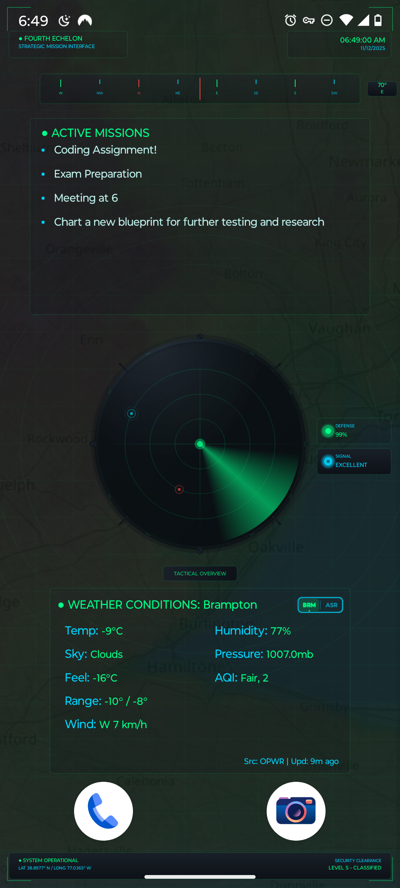
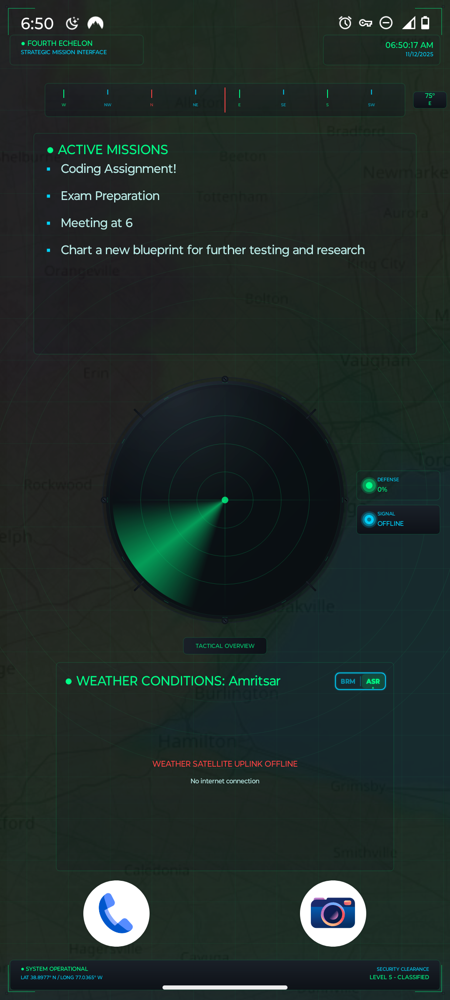

# 🛰️ SpyWatch – Tactical Live Wallpaper

 

> A futuristic HUD-style surveillance live wallpaper that transforms your Android home screen into a tactical command interface — complete with real-time weather, radar scanning, compass heading, and animated mission systems.

---

## ✨ Features

### 🎯 Core Functionality
- **Live Compass Heading** using onboard sensors
- **Mission Dashboard** integrated with my **TasksApp**
  - SpyWatch automatically reads the latest active tasks  
  - Displays them as “Mission Objectives” on the HUD  
  - Instant updates when tasks change
- **Animated Radar Watch Scanner**
- **WiFi + Network Status Monitoring**
- **Live Weather Panel** (OpenWeatherMap API)
- **City Toggle**: Brampton ↔ Amritsar

### 🎨 Visual Design
- Tactical HUD interface with neon aesthetics
- **3D Depth Panels & Parallax Map**
- Smooth **60FPS animations**
- Pulsing scan indicators & visual telemetry

### 🔧 Technical Features
- Custom low-latency **Canvas rendering engine**
- Efficient **coroutine-based network pipeline**
- Real-time task ingestion from **TasksApp**
- Weather caching to reduce API calls
- **Touch interaction** for quick city switching with haptic feedback
- **Battery-optimized** render loop

---

## 🚀 Installation

### Requirements
- Android Studio Flamingo or newer  
- Android 8.0+ device  
- OpenWeatherMap API key
- **My TasksApp installed** (for Mission Panel)

### Setup
```bash
git clone https://github.com/yourusername/spywatch.git
cd spywatch  
Create a local.properties file:  
weather.api.key=your_openweathermap_api_key_here  
Open → Build → Run

